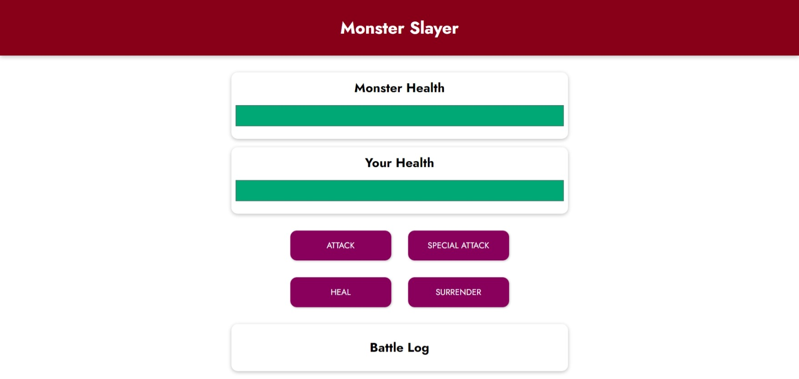
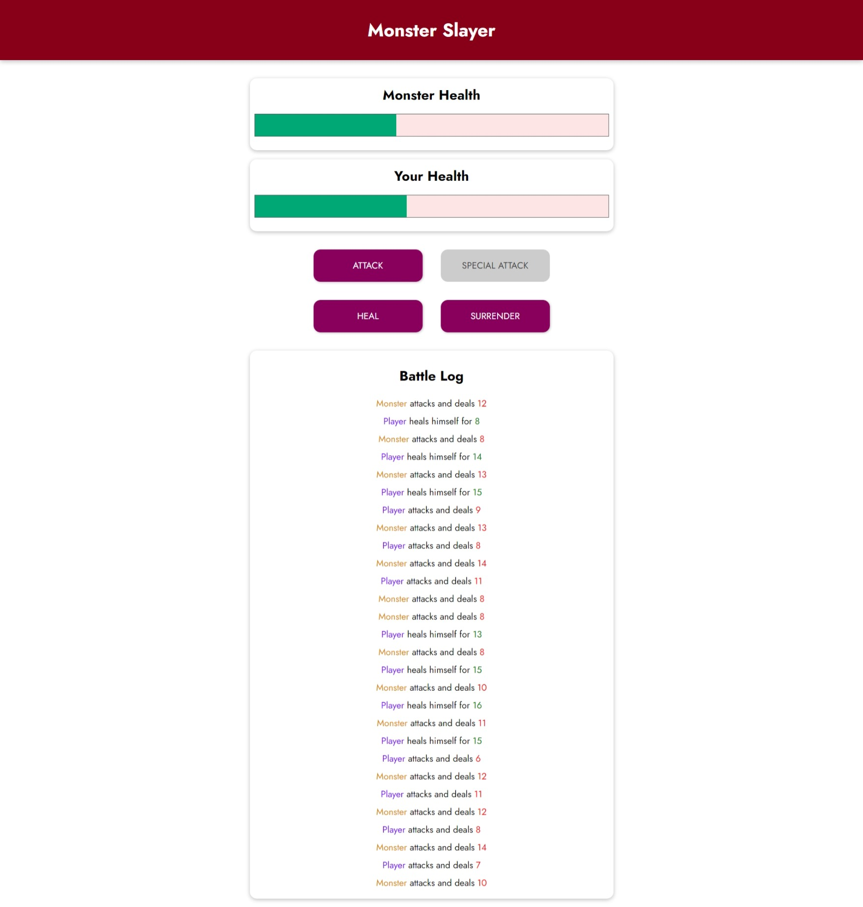
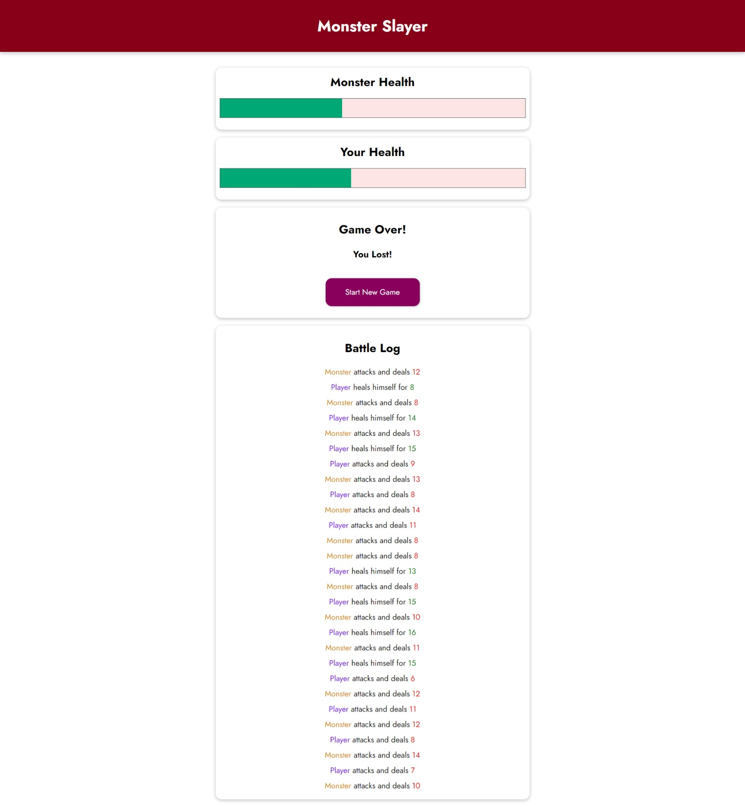
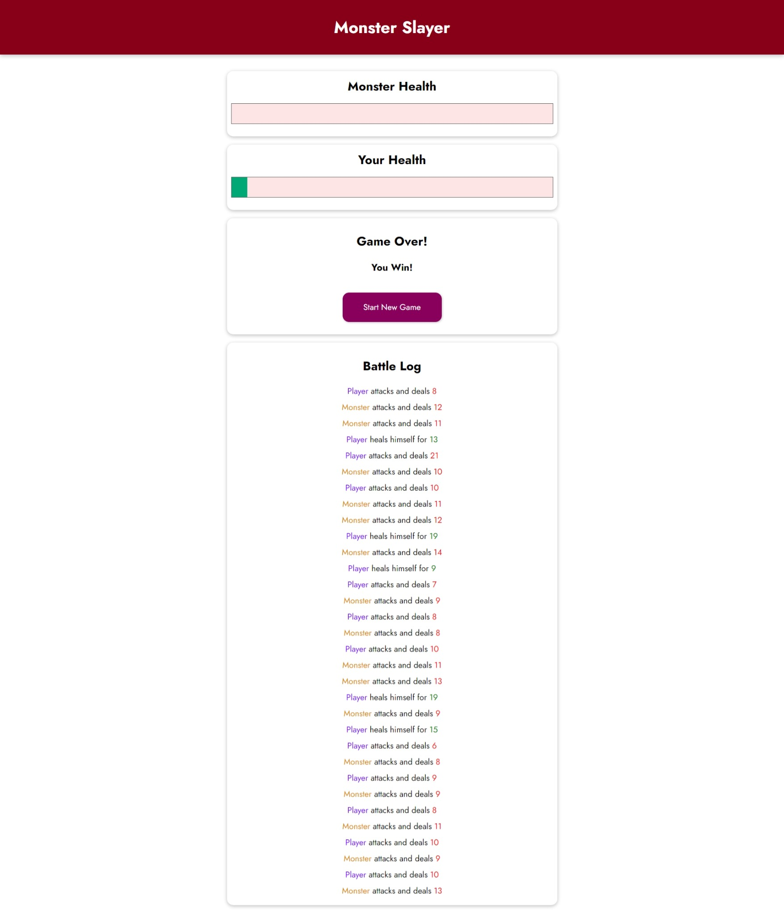

    <h1 align='center'><i>Monster Slayer</i></h1>
    
 Simple game built with vue 

<h2 style="display:inline">📝 Table of Contents</h2>

- 📑 About
- ⛏️ Built With
- 📷 Screenshots
- ✍️ Contributors
- 🔒 License

## 📑 About

- Monster slayer game is a game that allows the user to play with the monster and attack it and heal himself with different potions. The game is built using Vue js.

## ⛏️ Built With

- Vue js

## 📷 Screenshots

### Start

### Log

### Surrender

### Win

## ✍️ Contributors

<table>
  <tr>

<td align="center">
<a href="https://github.com/Abd-ELrahmanHamza" target="_black">
 <b>Abdelrahman Hamza</b></a> 
</td>

</tr>
 </table>

## 🔒 License 

> This software is licensed under MIT License, See [License](./LICENSE) .
